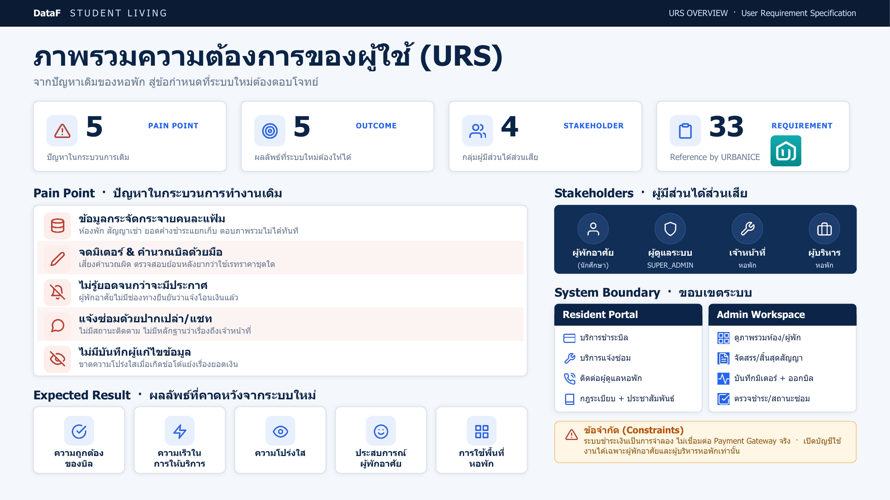
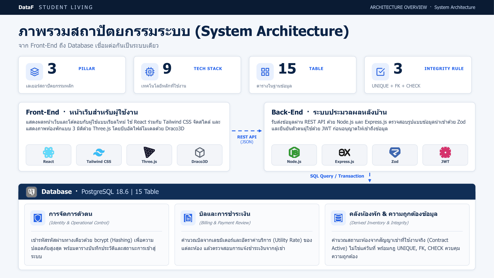
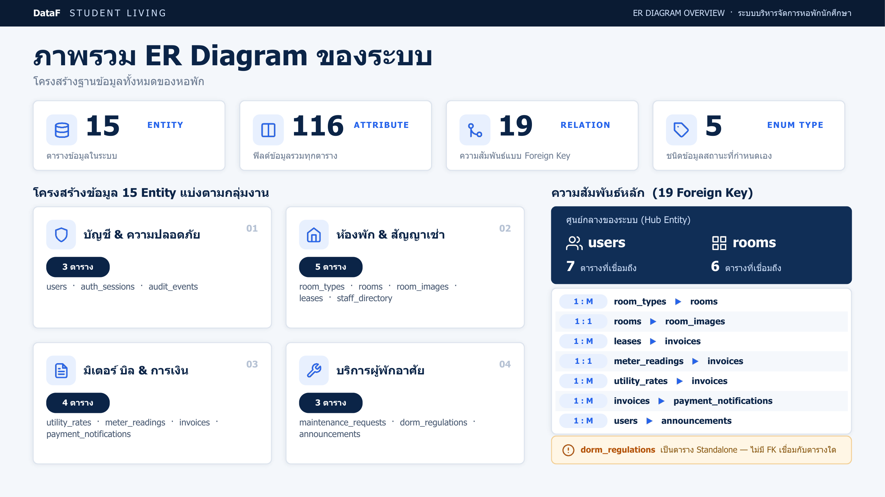
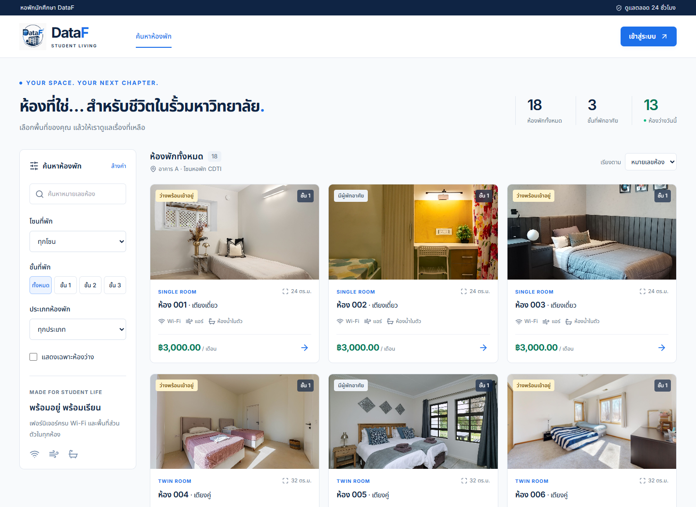
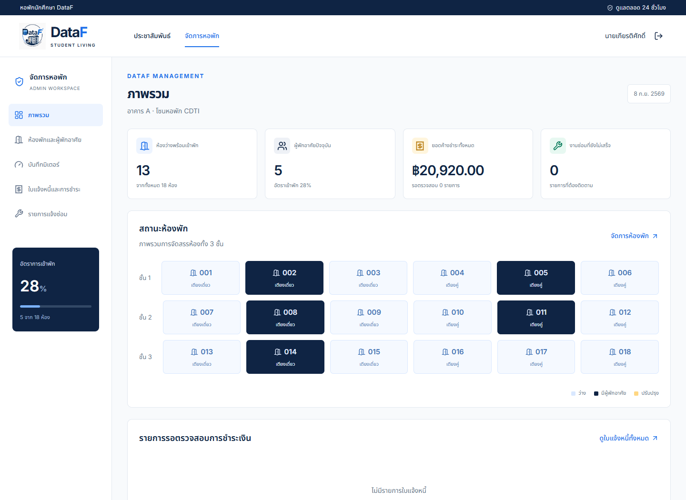
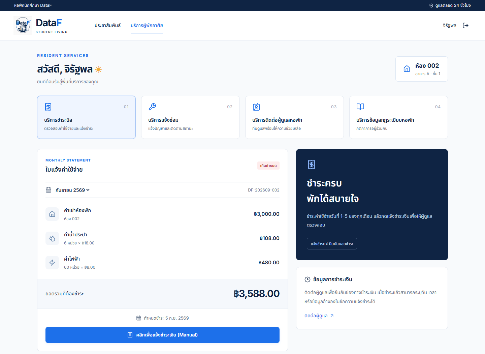
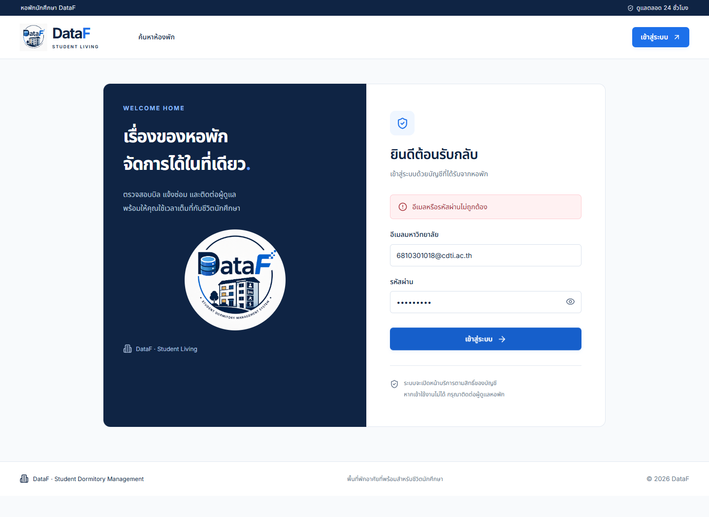
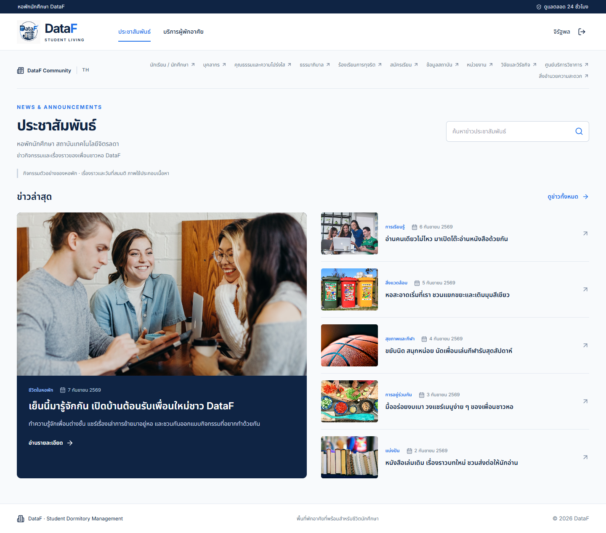
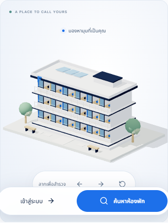
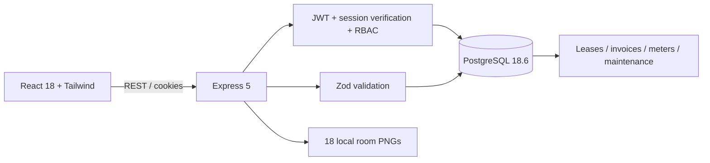

# DataF · Student Dormitory Management

ระบบจัดการหอพักนักศึกษา ตามแผน 5 ระยะ: PostgreSQL → Express API → React + Tailwind → ภาพห้องพัก → ตรวจสอบบัญชีและสิทธิ์การใช้งาน

## ภาพรวมโครงการ

| URS (User Requirement Specification) | System Architecture | ER Diagram |
|---|---|---|
| [](docs/URS_Overview.pdf) | [](docs/Architecture_Overview.pdf) | [](docs/ER_Diagram_Overview.pdf) |

ไฟล์ต้นฉบับ (PDF) อยู่ใน [`docs/`](docs/) คลิกภาพเพื่อเปิดไฟล์เต็ม ส่วนไดอะแกรมความสัมพันธ์ตารางแบบละเอียด (dbdiagram.io) อยู่ที่ [`database/ER_Diagram.svg`](database/ER_Diagram.svg) และ [`database/ER_Diagram_Details.docx`](database/ER_Diagram_Details.docx)

## เปิดใช้งาน

- เว็บสำหรับพัฒนา: http://127.0.0.1:5173
- เว็บจาก production build และ REST API: http://127.0.0.1:4000
- Health: http://127.0.0.1:4000/api/v1/health
- ฐานข้อมูลเฉพาะโครงการ: PostgreSQL **18.6**, `dataf_dorm`, `127.0.0.1:5432`, role แอป `dataf`

โปรเจกต์ใช้ PostgreSQL ที่ติดตั้งบนเครื่อง (system-wide) เป็นหลัก บัญชีที่แอปใช้ชื่อ `dataf` ไม่มีสิทธิ์ superuser รหัสเชื่อมต่อและ JWT secret เก็บใน `.env` ซึ่งถูกยกเว้นจาก Git เสมอ

### เริ่มระบบที่ติดตั้งแล้ว

```powershell
npm run dev
```

เปิด http://127.0.0.1:5173 ใช้ Ctrl+C เพื่อหยุด Vite และ Express เมื่อเสร็จงาน

### Production build บนเครื่อง

```powershell
npm run build
npm start
```

เปิด http://127.0.0.1:4000 Express จะให้บริการทั้ง API, ภาพ และ React SPA รวมถึงการเปิด `/`, `/search`, `/login`, `/announcements`, `/announcements/:slug`, `/admin` และ `/resident` โดยตรง หยุด dev server เดิมก่อนใช้ `npm start` เพื่อไม่ให้พอร์ต 4000 ซ้ำ

### ติดตั้งใหม่บน Windows (มี PostgreSQL 18.6 ติดตั้งอยู่แล้ว)

ต้องมี Node.js 22.12+ และ npm (ทดสอบด้วย Node 24.14) และ PostgreSQL 18.6 ที่รันอยู่ที่ `127.0.0.1:5432`

```powershell
npm ci
copy .env.example .env
# แก้ .env: ตั้ง DATABASE_ADMIN_URL ให้ชี้ไปบัญชี superuser ของ PostgreSQL (เช่น postgres)
# และตั้ง JWT_SECRET ด้วย: node -e "console.log(require('crypto').randomBytes(48).toString('hex'))"
npm run db:init
npm run dev
```

`db:init` ใช้ `DATABASE_ADMIN_URL` สร้าง role `dataf` และฐานข้อมูล `dataf_dorm` เมื่อยังไม่มี จากนั้นรัน `seed.sql` ด้วยบัญชีแอป สามารถรัน seed ซ้ำได้โดยไม่ล้างข้อมูลหรือเปลี่ยนรหัสผ่านเดิม (ดูรายละเอียดใน `scripts/init-db.mjs`)

### ทางเลือก: ติดตั้ง PostgreSQL 16 แบบแยกเฉพาะโปรเจกต์ (ไม่ต้องมี PostgreSQL ติดตั้งบนเครื่อง)

สำหรับเครื่องที่ไม่มี PostgreSQL ติดตั้งไว้ โปรเจกต์มีสคริปต์ที่ดาวน์โหลดและรัน PostgreSQL 16 แยกต่างหากภายใต้ `.local/` (ไม่ยุ่งกับ PostgreSQL ระบบ) ที่พอร์ต `55432`:

```powershell
npm ci
New-Item -ItemType Directory -Path .local -Force
curl.exe --fail --location https://get.enterprisedb.com/postgresql/postgresql-16.15-1-windows-x64-binaries.zip --output .local/postgresql16.zip
Expand-Archive -LiteralPath .local/postgresql16.zip -DestinationPath .local/postgresql16
powershell -NoProfile -ExecutionPolicy Bypass -File scripts/local-db.ps1 setup
npm run db:init
npm run dev
```

คำสั่ง `setup` จะสร้าง `.env` เฉพาะเมื่อยังไม่มีไฟล์ และไม่ทับค่าที่มีอยู่ ใช้ `npm run db:start` / `npm run db:stop` เพื่อคุมอินสแตนซ์นี้แยกจากฐานข้อมูลระบบ

### ใช้ PostgreSQL ที่จัดเตรียมเอง / macOS / Linux

1. สร้างฐานข้อมูล `dataf_dorm` ที่ใช้ UTF-8 และบัญชีแอปที่มีสิทธิ์เป็นเจ้าของฐานข้อมูล
2. คัดลอก `.env.example` เป็น `.env` ตั้ง `DATABASE_URL` และ `JWT_SECRET` อย่างน้อย 32 ตัวอักษร สร้าง secret ด้วย `node -e "console.log(require('crypto').randomBytes(48).toString('hex'))"`
3. รัน `npm ci`, `npm run db:init`, `npm run dev`
4. หรือรัน SQL โดยตรง: `psql -v ON_ERROR_STOP=1 -d dataf_dorm -f database/seed.sql` ภายใต้บัญชีที่มีสิทธิ์สร้าง schema และ extension `pgcrypto`

สำหรับระบบ HTTPS ให้ตั้ง `NODE_ENV=production`, `CLIENT_ORIGIN` เป็น origin ที่ได้รับอนุญาต และดูแล reverse proxy, TLS, backup และการหมุนรหัสผ่านก่อนเปิดให้ผู้ใช้จริง Cookies แบบ Secure จะไม่ใช้กับ HTTP ทั่วไป จึงให้การสาธิตบน localhost คง `NODE_ENV=development`

## บัญชีเริ่มต้น (ข้อมูลสาธิตตามเอกสาร)

| สิทธิ์ | อีเมล | รหัสผ่าน | ห้อง |
|---|---|---|---|
| ผู้ดูแล | 6810301018@cdti.ac.th | `kiadpr` | — |
| ผู้พักอาศัย | 6810301035@cdti.ac.th | `jiravi` | 002 |
| ผู้พักอาศัย | 6510301001@cdti.ac.th | `weersa` | 005 |
| ผู้พักอาศัย | 6810301028@cdti.ac.th | `hongsi` | 008 |
| ผู้พักอาศัย | 6810301010@cdti.ac.th | `phipso` | 011 |
| ผู้พักอาศัย | 6810301026@cdti.ac.th | `thansa` | 014 |

รหัสผ่าน 6 ตัวใช้ตามข้อมูลเริ่มต้นที่ร้องขอ เก็บในฐานข้อมูลด้วย bcrypt cost 12 บัญชีและ CSV นี้เป็น fixtures สำหรับสาธิต ไม่ใช่ระบบสมัครสมาชิกหรือกู้รหัสผ่าน เปลี่ยนข้อมูลบัญชีเริ่มต้นก่อนใช้งานจริง **Repo นี้เป็น Private เพราะมีชื่อ-เบอร์โทรจริงของผู้จัดทำอยู่ในข้อมูลสาธิต — อย่าเปลี่ยนเป็น Public โดยไม่ลบ/สุ่มข้อมูลส่วนตัวเหล่านี้ก่อน**

## ภาพรวมของระบบ

ภาพหน้าจอจริงจากชุดทดสอบอัตโนมัติ (Playwright) เก็บไว้ที่ [`Image/ภาพรวมของระบบ/`](Image/ภาพรวมของระบบ/) — คัดลอกมาจาก `test-results/` (โฟลเดอร์ทดสอบที่ไม่ถูกเก็บใน Git) เพื่อให้ภาพเหล่านี้แสดงบน GitHub ได้

| หน้า Public Catalog | Admin Dashboard | Resident Portal |
|---|---|---|
|  |  |  |

| หน้า Login | ประชาสัมพันธ์ | Home 3D (มือถือ) |
|---|---|---|
|  |  |  |

คู่มือใช้งานแบบทีละขั้นตอน (ภาพหน้าจอ 12 ขั้นตอน ตั้งแต่ล็อกอินจนถึงงานผู้ดูแล) อยู่ที่ [`Image/ภาพรวมของระบบ/คู่มือการใช้งาน/`](Image/ภาพรวมของระบบ/คู่มือการใช้งาน/)

## ความสามารถที่ใช้งานได้

### Home Landing Page

เปิด `/` เพื่อดูหน้าแนะนำหอพักพร้อมอาคาร 3D ที่ค่อย ๆ ประกอบและแยกชิ้นส่วน ผู้ใช้ลากหมุนอาคารหรือหยุดการเคลื่อนไหวได้ ปุ่ม "ค้นหาห้องพัก" และ "เข้าสู่ระบบ" อยู่ในกลุ่มเดียวกันด้านบน และเป็นแถบลอยด้านล่างบนมือถือ หน้า Home เปิดได้ทั้งก่อนและหลังเข้าสู่ระบบ

Three.js โหลดแยกเฉพาะหน้า Home โมเดล GLB ที่บีบอัดด้วย Draco และ decoder เก็บในโครงการ หากอุปกรณ์ใช้ WebGL ไม่ได้หรือกำหนดลดการเคลื่อนไหว ยังแสดงภาพอาคารและกดปุ่มนำทางได้

| Route | การใช้งาน |
|---|---|
| `/` | Home Landing Page สำหรับทุกคน |
| `/search` | หน้า "ค้นหาห้องพัก" เดิมสำหรับผู้ยังไม่เข้าสู่ระบบ |
| `/login` | เข้าสู่ระบบและเปิดหน้าให้ตรงบทบาท |
| `/announcements` และ `/announcements/:slug` | ข่าวกิจกรรมสำหรับผู้เข้าสู่ระบบ |
| `/resident` | บริการผู้พักอาศัย |
| `/admin` | งานผู้ดูแล |

เมื่อผู้ที่เข้าสู่ระบบแล้วเปิด `/search` ระบบคงกติกาเดิมคือพาไป `/announcements` โดยไม่มีการแก้ไขเนื้อหา ตัวกรอง หรือรายละเอียดใน `PublicCatalog.jsx`

### Public Catalog ที่ `/search` สำหรับผู้ที่ยังไม่เข้าสู่ระบบ

แสดง 18 ห้อง / 3 ชั้น: เตียงเดี่ยว 9 ห้อง ค่าเช่า 3,000 บาท และเตียงคู่ 9 ห้อง ค่าเช่า 4,000 บาท มีผู้พักอาศัย 5 ห้อง เหลือ 13 ห้องว่าง ตัวกรองหมายเลขห้อง ชั้น ประเภท โซน และเฉพาะห้องว่าง พร้อมเรียงราคา เปิดรายละเอียดห้องและค่าใช้จ่าย หน้า public ไม่ส่งชื่อผู้พักอาศัย เบอร์โทร อีเมล หรือ UUID ของผู้พักอาศัย

### ประชาสัมพันธ์สำหรับผู้เข้าสู่ระบบ

เมนู "ประชาสัมพันธ์" เปิด `/announcements` สำหรับผู้ดูแลและผู้พักอาศัย แสดงข่าวกิจกรรมสมมติ 6 รายการเป็นการ์ดภาพ หัวข้อ และรายละเอียดที่ปรับตามขนาดจอ: จัดข่าวหลักขนาดใหญ่หนึ่งรายการกับข่าวเพิ่มเติม 5 รายการบนคอมพิวเตอร์ และปรับเป็นลำดับแนวตั้งบนจอแคบ พิมพ์คำในช่องค้นหาแล้วส่งคำค้นเพื่อกรองข่าว กด "ดูข่าวทั้งหมด" เพื่อดูการ์ดครบ 6 รายการ กดหัวข้อหรือภาพเพื่ออ่านรายละเอียดที่ `/announcements/:slug` และใช้ "กลับข่าวประชาสัมพันธ์" กลับหน้ารวม เมนูนี้ใช้แทนลิงก์ Catalog หลังเข้าสู่ระบบ ส่วนหน้า Public Catalog ใช้กับผู้ที่ยังไม่เข้าสู่ระบบ ข่าวและวันที่เป็นเนื้อหากิจกรรมสมมติสำหรับสาธิตระบบ ไม่ใช่กำหนดการจัดกิจกรรมจริง

### Resident Services

1. **บริการชำระบิล:** ดูรายการค่าเช่า น้ำ ไฟ เลือกรอบบิล และส่งข้อความแจ้งชำระแบบ Manual สถานะรอตรวจสอบจนกว่าผู้ดูแลยืนยัน ไม่มี payment gateway, OCR หรืออัปโหลดสลิป
2. **บริการแจ้งซ่อม:** หมวดแอร์ ประปา ไฟฟ้า เฟอร์นิเจอร์ และอื่น ๆ ระบุข้อความ 10–2,000 ตัวอักษร ห้องได้จากสัญญาปัจจุบันบน server ไม่รับ room ID จากผู้พักอาศัย ไม่รับไฟล์แนบ
3. **บริการติดต่อผู้ดูแล:** ผู้จัดการ แม่บ้าน รปภ.กลางวัน/กลางคืน และช่าง พร้อมเวลาและลิงก์โทรศัพท์
4. **บริการกฎระเบียบ:** กฎภาษาไทยครบ 5 ข้อ มีผล 1 สิงหาคม 2026 ตามข้อความในเอกสารต้นทาง

### Admin Back Office

- KPI ห้องว่าง อัตราเข้าพัก ยอดค้างชำระ งานซ่อม และรายการแจ้งชำระที่รอตรวจสอบ
- แผนผังห้องรายชั้นและรายชื่อผู้พักอาศัย
- สิ้นสุดสัญญา จัดสรรผู้พักอาศัยที่ยังไม่มีห้อง และเปิด/ปิดห้องเพื่อซ่อมบำรุง
- บันทึกมิเตอร์ต่อเนื่องจากรายการล่าสุด และออกใบแจ้งหนี้รายเดือน
- ตรวจสอบ/ส่งคืน/ยืนยันการแจ้งชำระ และเปลี่ยนสถานะงานซ่อม

ไม่มีการลบประวัติเมื่อสิ้นสุดสัญญา ใบแจ้งหนี้เก่ายังคงเป็นของผู้พักอาศัยเดิมตามรอบบิล การจัดสรรใหม่มีผลทันทีตามสัญญาที่ active ไม่ใช่ระบบสำรองห้องล่วงหน้า

## สูตรและข้อมูลตั้งต้น

```text
ค่าน้ำ = (มิเตอร์น้ำปัจจุบัน − ครั้งก่อน) × 18
ค่าไฟ = (มิเตอร์ไฟปัจจุบัน − ครั้งก่อน) × 8
ยอดรวม = ค่าเช่า + ค่าน้ำ + ค่าไฟ
ห้อง 002 รอบกันยายน 2026 = 3,000 + (106−100)×18 + (560−500)×8 = 3,588 บาท
```

ใช้ PostgreSQL NUMERIC และปัดค่าสาธารณูปโภคเป็นทศนิยมสองตำแหน่ง ยอดรวมเป็น generated column มิเตอร์ห้ามย้อนหลัง/ลดลง/ซ้ำเดือน เลขครั้งก่อนต้องตรงกับเดือนล่าสุด ใบแจ้งหนี้เลือกอัตราที่มีผลในเดือนนั้น และเก็บยอดแต่ละรายการไว้ ไม่คำนวณใหม่ตามอัตราในอนาคต

Seed ใช้รอบบิลกันยายน 2026 สัญญา 1 สิงหาคม 2026 – 31 กรกฎาคม 2027 เงินประกันและค่าเช่าล่วงหน้าสมมติอย่างละหนึ่งเดือน ขนาดห้อง 24/32 ตร.ม. สิ่งอำนวยความสะดวก ชื่อเจ้าหน้าที่เพิ่มเติม และภาพเป็นข้อมูลประกอบสาธิต ควรยืนยันกับสถานที่จริงก่อนนำไปเสนอผู้เช่า

สถานะเกินกำหนดคำนวณตามวันในเขต Asia/Bangkok นโยบายค่าปรับ/คีย์การ์ด/ตัดไฟแสดงตามเอกสารเท่านั้น แอปไม่คิดค่าปรับอัตโนมัติและไม่สั่งอุปกรณ์ภายนอก

## REST API

ทุก API อยู่ใต้ `/api/v1` รูปแบบข้อผิดพลาด `{ "error": "ข้อความ" }` พร้อม HTTP 400/401/403/404/409/429/500

ทุกคำขอเขียนข้อมูลต้องส่ง `Content-Type: application/json` และ `X-DataF-Request: 1` Frontend ตั้งค่าให้อัตโนมัติ JWT อยู่ใน HttpOnly / SameSite=Lax cookie อายุ 8 ชั่วโมง มี session record บน server เพื่อยกเลิก token เมื่อ logout และเมื่อ refresh ไม่เก็บ token ใน localStorage

| Method | Path | สิทธิ์ / การทำงาน |
|---|---|---|
| GET | `/health` | Public · ตรวจการเชื่อมต่อฐานข้อมูล |
| POST | `/auth/login` | Public · `{email,password}` |
| GET | `/auth/me` | เข้าสู่ระบบ · ผู้ใช้และห้องปัจจุบัน |
| POST | `/auth/refresh` | เข้าสู่ระบบ · หมุน session และยกเลิก token เดิม |
| POST | `/auth/logout` | เข้าสู่ระบบ · revoke session, ล้าง cookie |
| GET | `/rooms` | Public · `floor`, `bed_type`, `status`, `zone` |
| GET | `/rooms/:id`, `/room-types` | Public · รายละเอียดและประเภท |
| GET | `/invoices`, `/invoices/:id` | ผู้พักอาศัยเห็นของตัวเอง / ผู้ดูแลเห็นทั้งหมด |
| POST | `/invoices/:id/payment-notification` | ผู้พักอาศัย · `{note?}` |
| POST | `/invoices/:id/payment-review` | ผู้ดูแล · `{decision: APPROVED | REJECTED}` |
| GET / POST | `/maintenance` | GET ตามสิทธิ์, POST ผู้พักอาศัย · `{category,description}` |
| PATCH | `/maintenance/:id` | ผู้ดูแล · `{status: REPORTED | IN_PROGRESS | RESOLVED}` |
| GET | `/staff`, `/regulations`, `/utility-rates` | ผู้ใช้ที่เข้าสู่ระบบ |
| GET | `/admin/overview`, `/admin/rooms`, `/admin/residents` | ผู้ดูแล |
| POST | `/rooms/:id/lease` | ผู้ดูแล · `{resident_id,start_date,end_date,deposit_paid}` |
| POST | `/leases/:id/end` | ผู้ดูแล · สิ้นสุดสัญญา |
| PATCH | `/rooms/:id/status` | ผู้ดูแล · `{status: VACANT | MAINTENANCE}` |
| GET / POST | `/meter-readings` | ผู้ดูแล · room_id, billing_month และเลขมิเตอร์ก่อน/หลัง |
| POST | `/invoices/generate` | ผู้ดูแล · `{room_id,billing_cycle}` |

วันที่รอบบิลต้องเป็น `YYYY-MM-01` ทุกรายการ ใช้ validation แบบ strict, parameterized SQL, role middleware, tenant ownership checks, transaction/row locks, unique constraints, login rate limit และ audit log การกระทำหลัก

## โครงสร้างโครงการ

```text
database/schema.sql              # schema source
database/seed.sql                # schema + bcrypt-hashed demo records, one transaction
database/schema.dbml             # ER diagram source for dbdiagram.io
database/ER_Diagram.svg          # ER diagram (rendered)
database/ER_Diagram_Details.docx # ER diagram, extended notes
database/*.csv                   # user registry and 18-room inventory (source fixtures)
database/migrations/             # applied schema migrations
server/src/{auth,catalog,services}.js
server/src/{app,db,config,validation,billing}.js
server/test/                     # real PostgreSQL integration and billing tests
client/src/pages/Announcements.jsx # authenticated mock dorm activity news
client/src/data/announcements.js  # six mock activity records
client/src/pages/HomeLanding.jsx
client/src/components/landing/  # isolated Home navigation + 3D canvas
client/src/pages/PublicCatalog.jsx
client/src/pages/LoginPage.jsx
client/src/pages/AdminDashboard.jsx
client/src/pages/ResidentPortal.jsx
client/src/components/           # shared layout, forms, dialog, statuses
client/src/styles.css            # responsive design and brand tokens
client/public/logo.png           # logo served by the running app
client/public/news/              # six mock announcement images
client/public/models/            # 3D dormitory model (Draco-compressed GLB)
รูปห้องพัก/ชั้น{1,2,3}/           # exact Thai directory hierarchy; 18 PNGs, served by the app
docs/                           # source PDFs behind the overview images below
Image/                          # documentation images only — not used by the running app
Image/เอกสารออกแบบระบบ/          # rendered previews of the docs/ PDFs (URS, architecture, ER)
Image/ภาพรวมของระบบ/             # curated screenshots (mirrors test-results/, see below)
Image/ภาพรวมของระบบ/คู่มือการใช้งาน/ # step-by-step user manual screenshots
Image/แบรนด์/                    # brand logo (source copy; the running app uses client/public/logo.png)
scripts/                        # setup, seed generation, smoke and browser checks
```

ภาพห้องพักถูกเสิร์ฟผ่าน `/room-images/` (alias ของโฟลเดอร์ `รูปห้องพัก`) และ `/รูปห้องพัก/` ภาพมี 18 ไฟล์จริง ไม่พึ่ง remote hotlink ขณะเปิดเว็บ **ห้ามย้ายไฟล์ในโฟลเดอร์นี้** เพราะ `seed.sql` และ server อ้างอิง path ตรงกับโครงสร้างไฟล์จริง

## แบบจำลองข้อมูล

เปิด `database/schema.dbml` ใน dbdiagram.io ได้ แบ่งเป็น users, room_types, rooms, room_images, leases, utility_rates, meter_readings, invoices, payment_notifications, maintenance_requests, staff_directory, dorm_regulations, auth_sessions และ audit_events

แยกข้อมูลผู้ใช้ ประเภทห้อง สัญญา และอัตราค่าสาธารณูปโภคเพื่อลดข้อมูลซ้ำตามหลัก 3NF สถานะ OCCUPIED และ current_resident_id ได้จาก `room_inventory` view ที่ join สัญญา active ไม่เก็บ tenant pointer ซ้ำใน rooms ใช้ partial unique indexes รับประกันหนึ่งสัญญา active ต่อหนึ่งห้องและต่อหนึ่งผู้พักอาศัย จำนวนเงินใน invoice เป็น snapshot ทางบัญชีโดยเจตนา ยอดรวมเป็น generated column เพื่อไม่ให้ผลรวมคลาดเคลื่อน



## ตรวจสอบระบบ

```powershell
npm test
npm run build
npm run test:smoke
npm run test:browser
npm audit
```

- `npm test`: billing unit tests และ integration tests ที่สร้างฐานข้อมูล `dataf_test_*` ชั่วคราว ทดสอบเสร็จลบเฉพาะฐานที่เพิ่งสร้าง ต้องตั้ง `DATABASE_ADMIN_URL` สำหรับการสร้าง test database
- `test:smoke`: ทดสอบบริการที่พอร์ต 4000 พร้อมบัญชีทั้ง 6 ไม่แก้ห้อง บิล หรืองานซ่อม (สร้าง/ยกเลิก session ตามขั้นตอน login)
- `test:browser`: ใช้ Microsoft Edge แบบ headless บน Windows และฐานข้อมูล `dataf_browser_*` แยก ทดสอบ frontend จริงกับ production build ต้อง `npm run build` ก่อน และมี `DATABASE_ADMIN_URL`; ระบบอื่นติดตั้ง browser ที่ Playwright รองรับแล้วตั้ง `BROWSER_CHANNEL`
- ผลและภาพจาก browser tests อยู่ใน `test-results/` ซึ่งไม่ถูกเก็บใน Git — ภาพชุดที่คัดไว้แสดงในเอกสารถูกคัดลอกไปที่ `Image/ภาพรวมของระบบ/` แยกต่างหาก (ดูหัวข้อ "ภาพรวมของระบบ" ด้านบน)

ระบบ Web Dev, Data Engineer และ Frontend ตามแผนห้าระยะใช้ Express + PostgreSQL ตามข้อกำหนดของงาน

ตัวเลข ROI หรือการวิเคราะห์ธุรกิจใด ๆ ที่อ้างถึงในเอกสารประกอบเป็นสมมติฐานเพื่อการนำเสนอ ไม่ใช่ผลประหยัดหรือรายได้ที่วัดจริงจากการใช้งาน
